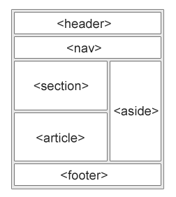

#01 零基础 HTML 编码

3/20/2016 5:27:16 PM 

- 语义化
- 细节是整体的升华

HTML5提供了新的语义元素来明确一个Web页面的不同部分:

    <header>
    <nav>
    <section>
    <article>
    <aside>
    <figcaption>
    <figure>
    <footer>

##部分相关知识复习

`<section>` 标签定义文档中的节（section、区段）。比如章节、页眉、页脚或文档中的其他部分。

`<article> `标签定义独立的内容。

`<article> `元素使用实例:

- Forum post 论坛帖子
- Blog post 博客文章
- News story 新闻故事
- Comment 评论

`<figure>`标签规定独立的流内容（图像、图表、照片、代码等等）。
`<figure>` 元素的内容应该与主内容相关，但如果被删除，则不应对文档流产生影响。

`<figcaption>` 标签定义 `<figure>` 元素的标题.
`<figcaption>`元素应该被置于 "figure" 元素的第一个或最后一个子元素的位置。

## 在线学习参考资料

[Web相关名词通俗解释](https://www.zhihu.com/question/22689579)

[MDN HTML入门](https://developer.mozilla.org/zh-CN/docs/Web/Guide/HTML/Introduction)

